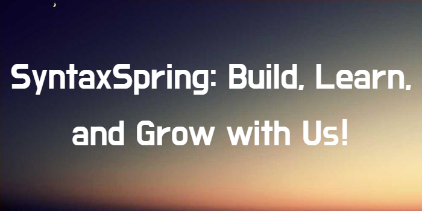

# Syntax Spring



Syntax Spring is a modern, interactive coding challenge platform designed to help developers improve their programming skills through hands-on practice. Built with Next.js, TypeScript, and Tailwind CSS, this platform offers a comprehensive learning experience with features like in-browser code execution, AI assistance, and community interaction.

## 🚀 Features

- **Interactive Coding Challenges**: Practice coding in multiple languages with our in-browser editor.
- **Real-time Code Execution**: Run your code and see results instantly, no waiting around.
- **Progress Tracking**: Level up your coding journey with streaks, badges, and points.
- **AI Assistance**: Stuck on a problem? Our AI assistant is here to help.
- **Community Features**: Connect with fellow coders, share ideas, and find study partners.
- **Responsive Design**: Optimized for desktop, tablet, and mobile devices.
- **Dark/Light Mode**: Switch themes and code in style.
- **User Authentication**: Secure login, registration, and account management.
- **Gamification**: Earn rewards, compete on leaderboards, and challenge yourself.

## 🛠️ Tech Stack

- **Frontend**: Next.js 14, React 18, TypeScript
- **Styling**: Tailwind CSS, shadcn/ui components
- **State Management**: React Hooks
- **Code Editor**: Monaco Editor
- **Animations**: Framer Motion
- **Authentication**: Custom auth system (integratable with Auth.js/NextAuth)
- **Deployment**: Vercel, with potential for Docker containerization

## 📋 Prerequisites

- **Node.js**: 18.x or higher
- **Package Manager**: npm, yarn, or pnpm

## 🚀 Getting Started

### Installation

1. **Clone the repository:**

   ```bash
   git clone https://github.com/AfuhFlynns/syntax-spring-app.git
   cd syntax-spring
   ```

2. **Install dependencies:**

   ```bash
   pnpm install  # or npm install / yarn install
   ```

3. **Run the development server:**

   ```bash
   pnpm dev  # or npm run dev / yarn dev
   ```

   Open your browser and navigate to [http://localhost:3000](http://localhost:3000) to see Syntax Spring in action.

### Configuration

- **Environment Variables**: Create a `.env.local` file in the root directory and configure any required environment variables. Example:

  ```env
  NEXT_PUBLIC_API_URL=http://localhost:3000/api
  NEXTAUTH_URL=http://localhost:3000
  ```

## 🚀 Usage

Syntax Spring is designed to be as intuitive as possible. Once you have the development server running, you can:

- Explore various coding challenges.
- Use the in-browser editor to write and test your code.
- Track your progress and compete on leaderboards.
- Access AI assistance when you need a hint or solution.

## 🛠️ Deployment

Deploying Syntax Spring is a breeze:

- **Vercel**: Push your changes to the main branch and deploy automatically using Vercel.
- **Docker**: For containerized deployments, use the provided Dockerfile to build and run your container:

  ```bash
  docker build -t syntax-spring .
  docker run -p 3000:3000 syntax-spring
  ```

- **Custom Hosting**: Follow the standard Next.js deployment guidelines for other hosting platforms.

## 🗺️ Roadmap

We're not here to play small. The roadmap for Syntax Spring includes:

- **Enhanced AI Capabilities**: Smarter, more intuitive code assistance.
- **Advanced Challenges**: New, dynamic coding problems to keep you on your toes.
- **Expanded Language Support**: More programming languages to broaden your skill set.
- **Mobile App**: A dedicated mobile experience for learning on the go.
- **Community Features**: More robust forums, study groups, and peer review options.

Have ideas? Open an issue or drop a feature suggestion. We're all about community-driven innovation.

## ❓ FAQ

**Q: Is Syntax Spring free to use?**  
A: Absolutely. Syntax Spring is open-source and free for everyone.

**Q: Can I contribute?**  
A: For sure! Check out our [CONTRIBUTING](./CONTRIBUTING.md) guidelines to get started.

**Q: What languages can I practice?**  
A: We're constantly expanding, but you'll find popular languages like JavaScript, Python, Java, and more.

**Q: How does AI assistance work?**  
A: Our integrated AI provides hints and guidance based on your code, helping you overcome tricky challenges.

## 📸 Screenshots

Below are some snapshots of Syntax Spring in action:

- **Home Screen**: Overview of challenges and progress.
- **Challenge View**: Interactive coding editor with live execution.
- **Leaderboard**: See where you stand among peers.
- **User Profile**: Manage your account, achievements, and settings.

*(Add your screenshots in the `public` folder and update the paths accordingly.)*

## 🤝 Community & Support

We thrive on community. Join our channels to:

- **Discuss Challenges**: Get tips and share your solutions.
- **Collaborate on Projects**: Connect with other developers.
- **Contribute Ideas**: Help shape the future of Syntax Spring.

- **Discord**: [Join our Discord](#) to chat with fellow coders.
- **GitHub Discussions**: [Join the conversation](https://github.com/AfuhFlynns/syntax-spring-app/discussions).

## 📄 License

Syntax Spring is licensed under the **MIT License**. See the [LICENSE](./LICENSE) file for details.

## Contributing

Want to help build the future of coding practice? Follow the instructions in our [CONTRIBUTING](./CONTRIBUTING.md) guide to get started.

## 📬 Contact

For any questions, feedback, or just to say hey, drop us an email at [contact@syntaxspring.dev](mailto:contact@syntaxspring.dev) or reach out on our Discord.

---

Feel free to open issues, suggest improvements, or contribute code. Let’s build something epic together! 🚀
